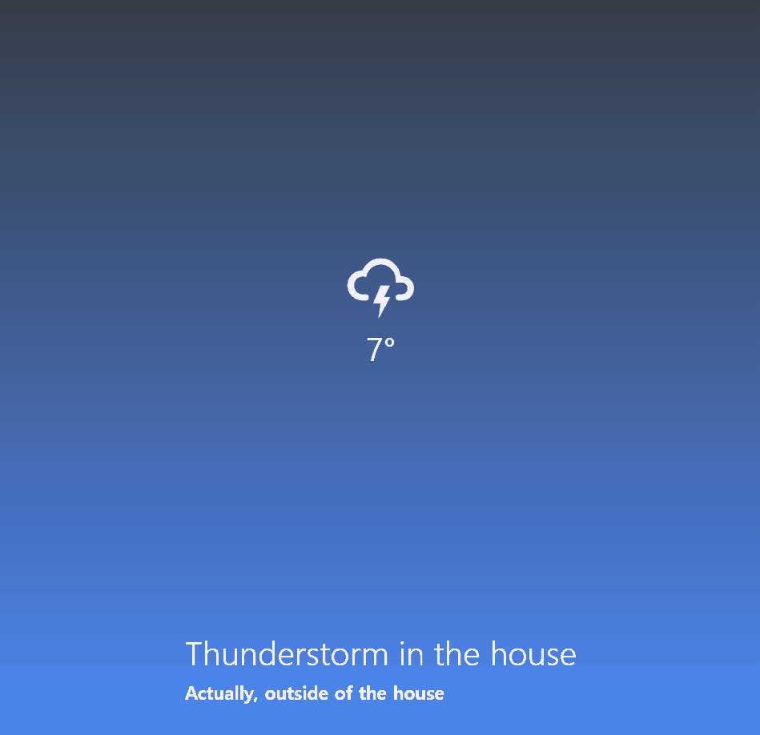

# Weather Project App

Learning `React Native` by building a weather-project App  
`2020.04.02 ~ 2020.04.12`

## Demo Link

- [Expo QR Code](https://expo.io/@wook2124/weather-project)

## Demo Video

## Project Description 

It is an app that informs the weather and temperature in real time according to the weather of the current location.  
현재 위치의 날씨에 맞게 실시간으로 날씨와 온도를 알려주는 앱입니다.

## Customization: How to run this project

Very simple. You can download the Expo app and check the [Expo QR Code](https://expo.io/@wook2124/weather-project).  
Expo App을 다운받은 뒤, Expo App에서 [Expo QR Code](https://expo.io/@wook2124/weather-project)를 QR코드로 찍어 확인하면 됩니다.

## What I used for this project 

- [X] React
- [X] React Native
- [X] Expo
