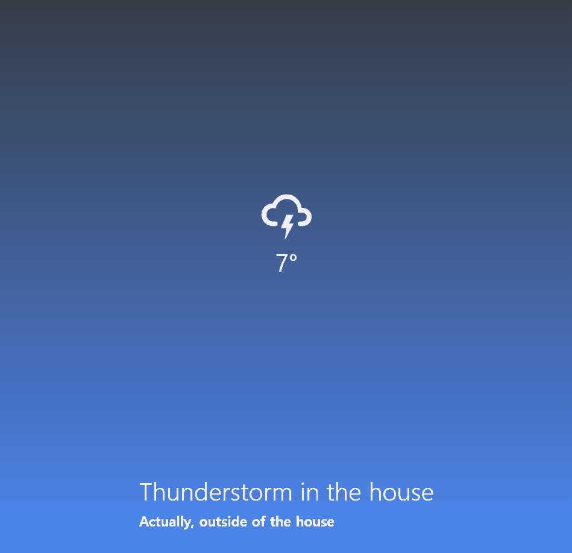

# Weather Project App

Learning React Native by building a weather-project App `2020.04.02 ~ 2020.04.12`

## Demo Link

- [Weather App](https://wook2124.github.io/movie_app/)
- [Expo QR Code](https://expo.io/@wook2124/weather-project)

## Demo Video

## Project Description 

This app informs the weather and temperature in real time according to the weather.  
날씨에 맞게 실시간으로 날씨와 온도를 알려주는 앱입니다.

## Customization: How to run this project

Very simple. You Just click Weather App or Expo QR Code.  
Weather App 혹은 Expo QR Code를 클릭하세요.

## What I used for this project 

- [X] React
- [X] React Native
- [X] Expo
